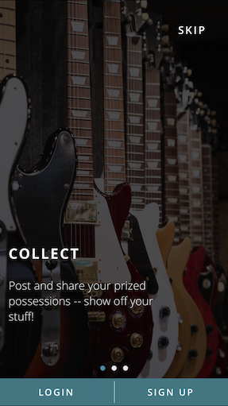
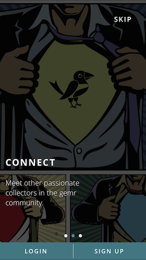
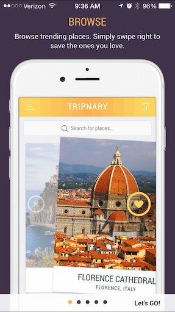
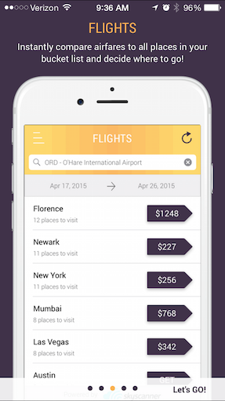
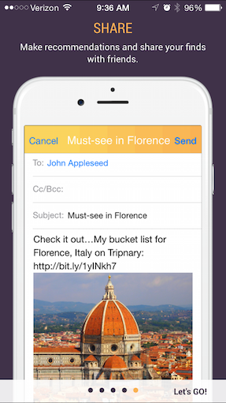
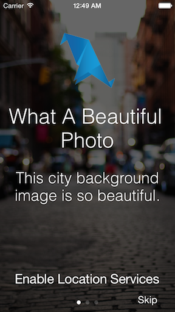
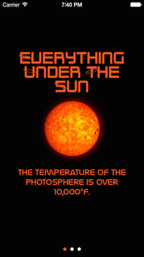
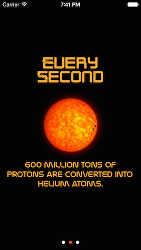
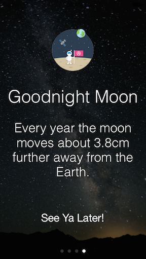
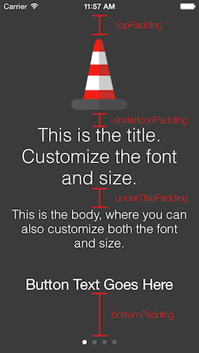

Onboard

[](https://travis-ci.org/mamaral/Onboard)

==================

Onboard provides developers with a quick and easy means to create a beautiful, engaging, and useful onboarding experience with only a few lines of code.


Apps Using Onboard
=============

If your app is currently using onboard, let me know and I would love to feature it here!

[Gemr](http://www.gemr.com/ "Gemr")
===






[Tripnary](http://tripnary.com/ "Tripnary")
===

Thanks to [goelv](https://github.com/goelv) for this! You did a superb job!







More Samples
=============











Compatibility
====

I currently have implementations written in both Objective-C and Swift, although currently due to time constraints the Swift implementation does not have all of the customization features available in the Objective-C version, namely the skipping feature, customizing different fonts for different components on the same page, etc. I will do my best to get the Swift version to match the Objective-C version as soon as possible, and any pull requests are welcomed in the meantime!


Usage
=====

CocoaPods
--------
I'm still new to implementing my own pods, so bear with me! Adding the following to your `Podfile` and running `pod install` should do the trick:

```ruby
pod 'Onboard', :git => 'https://github.com/mamaral/Onboard.git'
```

Manual
------
Drop the OnboardingViewController and OnboardingContentViewController header and implementation files into your project, import them into your AppDelegate, and you're ready to create an awesome onboarding experience for your users!

Create individual pages by creating an OnboardingContentViewController, providing it a title, body, image, text for an action button, and within the action block handle whatever you want to do when the users press the button. If you don't want a button, you can leave both the button text and action handler nil.

Objective-C
-------

```objective-c
OnboardingContentViewController *firstPage = [OnboardingContentViewController contentWithTitle:@"Page Title" body:@"Page body goes here." image:[UIImage imageNamed:@"icon"] buttonText:@"Text For Button" action:^{
    // do something here when users press the button, like ask for location services permissions, register for push notifications, connect to social media, or finish the onboarding process
}];
```

Swift
-------

```objective-c
let firstPage: OnboardingContentViewController = OnboardingContentViewController(title: "Page Title", body: "Page Body.", image: UIImage(named: "icon"), buttonText: "Button Text") {
    // do something here when the user presses the button
}
```

Then create the OnboardingViewController by providing either a background image or a URL to a local video file in your project, and an array of OnboardingContentViewControllers you just created. You can then present the view modally and get the onboarding process started!

Objective-C
-------

```objective-c
// Image
OnboardingViewController *onboardingVC = [OnboardingViewController onboardWithBackgroundImage:[UIImage imageNamed:@"background"] contents:@[firstPage, secondPage, thirdPage]];

// Video
NSBundle *bundle = [NSBundle mainBundle];
NSString *moviePath = [bundle pathForResource:@"yourVid" ofType:@"mp4"];
NSURL *movieURL = [NSURL fileURLWithPath:moviePath];

OnboardingViewController *onboardingVC = [OnboardingViewController onboardWithBackgroundVideoURL:movieURL contents:@[firstPage, secondPage, thirdPage]];
```

Swift
-------

```objective-c
let onboardingVC: OnboardingViewController = OnboardingViewController(backgroundImage: UIImage(named: "background"), contents: [firstPage, secondPage, thirdPage])
```

With only a few lines of code you have a beautiful, end-to-end onboarding process that will get your users excited to use your awesome application.


Customization
=============

The content pages can be customized by setting the provided padding, font, and size properties on either the pages individually (if you want something different on each) or on the OnboardingViewController itself, which will pass those properties to all of the content view controllers.

```objective-c
OnboardingViewController *onboardingVC = [OnboardingViewController onboardWithBackgroundImage contents:yourContentsArray];
onboardingVC.fontName = @"Helvetica-Light";
onboardingVC.titleFontSize = 28;
onboardingVC.bodyFontSize = 22;
onboardingVC.topPadding = 20;
onboardingVC.underIconPadding = 10;
onboardingVC.underTitlePadding = 15;
onboardingVC.bottomPadding = 20;

```



Blurring, Masking, and Fading
=============

By default, the image you use for the background will have a mask applied over it, darkening it a bit. This is to add a little bit of contrast so the text can more easily be seen. This can easily be disabled if your image is already edited or looks fine as-is:

```objective-c
onboardingVC.shouldMaskBackground = NO; // defaults to YES
```

We can also apply a blur to your background image:

```objective-c
onboardingVC.shouldBlurBackground = YES; // defaults to NO
```

Apply a fade effect to the icons, text, and buttons, while transitioning between pages. Contents fade out as you scroll away, and the contents for the next page fade in as they scroll in.

```objective-c
onboardingVC.shouldFadeTransitions = YES; // defaults to NO
```

You can tweak these settings in a few different combinations to get your desired effect:


Auto-Navigation
=============

If you want to automatically move users to the next page in the onboarding process when they press the action button simply set the `movesToNextViewController` property to `YES` on any `OnboardingContentViewController` that isn’t the last view controller in the onboarding process. Coupled with this, you can disable the ability to swipe between contents by setting the `swipingEnabled` property on the `OnboardingViewController` to `NO`. This allows you to have greater control over the onboarding process if you desire. Finally, if your design lends itself to not having a page control, or if it is only one page, you can set the `hidePageControl` property to `YES` and the page control dots will not appear.

```objective-c
contentVC.movesToNextViewController = YES;
onboardingVC.swipingEnabled = NO;
onboardingVC.hidePageControl = YES;
```

Skipping
=============

If you want to allow users to skip the onboarding process, enable skipping on the onboarding view controller and set a block to be executed when the skip button is pressed.

```objective-c
onboardingVC.allowSkipping = YES;
onboardingVC.skipHandler = ^{
    // Dismiss, fade out, etc...
};
```

Blocks
=========

There may be cases in which you want to do *something* when the content pages are about to appear, and when they did appear. In this case, you can set the viewWillAppearBlock and viewDidAppearBlock properties on any or all of the content pages to handle whatever you’d like.

```objective-c
contentVC.viewWillAppearBlock = ^{
	// do something when the view will appear here…
}

contentVC.viewDidAppearBlock = ^{
	// do something when the view appears here…
}
```


Notes
=====

I'm not currently supporting landscape at the moment, so I would recommend either using this in an application that only supports portrait, or wrapping it in a subclassed UINavigationController that only supports portrait.


Community
=====

Questions, comments, issues, and pull requests welcomed!!


License
=====

This project is made available under the MIT license. See LICENSE.txt for details.
